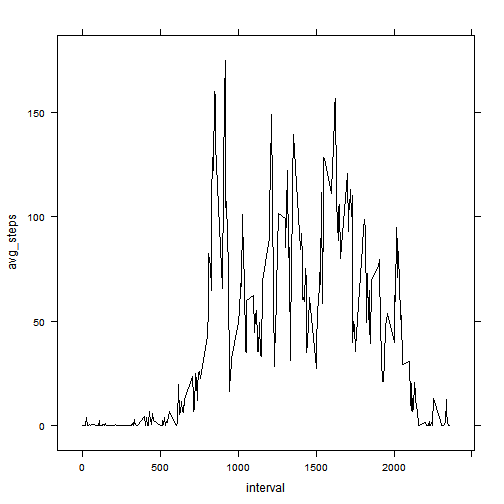

## Loading and preprocessing the data
1. use getBinaryURL() with verifypeer=FALSE to bypass ssl checking.
2. use unz() to get the unzipped file from the downloaded zipped format 

```r
library(RCurl)
```

```
## Loading required package: bitops
```

```r
fileUrl<-"https://d396qusza40orc.cloudfront.net/repdata%2Fdata%2Factivity.zip"  
zipFile <-'activity.zip'   
fileName<-'activity.csv'  
bin <- getBinaryURL(fileUrl,ssl.verifypeer=FALSE)
con <- file(zipFile, open = "wb")
writeBin(bin, con)
close(con)
setAs("character","myDate", function(from) as.Date(from, format="%Y-%m-%d"))  
```

```
## in method for 'coerce' with signature '"character","myDate"': no definition for class "myDate"
```

```r
data <- read.csv(unz(zipFile, fileName), header=TRUE, 
                 na.strings="NA",colClasses=c("date"="myDate")) 
```
## What is mean total number of steps taken per day?

```r
library(plyr)
library(dplyr)
```

```
## 
## Attaching package: 'dplyr'
## 
## The following objects are masked from 'package:plyr':
## 
##     arrange, desc, failwith, id, mutate, summarise, summarize
## 
## The following objects are masked from 'package:stats':
## 
##     filter, lag
## 
## The following objects are masked from 'package:base':
## 
##     intersect, setdiff, setequal, union
```

```r
library(lubridate)
```

```
## 
## Attaching package: 'lubridate'
## 
## The following object is masked from 'package:plyr':
## 
##     here
```

```r
newdata<-mutate(data,datetime=as.POSIXct(date)+dminutes(interval))
summary_data<-
    newdata %>%
      group_by(date) %>% 
        summarise(
                    total.steps=sum(steps,na.rm=TRUE),
                    avg.steps = if(total.steps >0) mean(steps,na.rm=TRUE) else 0
                 )
#summary_data

meanTotalSteps <-
    summary_data %>%
        summarize(mean(total.steps))
medianTotalSteps <-
    summary_data %>%
        summarize(median(total.steps))
library(ggplot2)
library(scales)
#qplot(date,total.steps,data=summary_data,geom=c("point","smooth"))

ggplot(summary_data,aes(x=date,y=total.steps)) + geom_bar(stat="identity")+
    scale_x_date(breaks=seq(min(summary_data$date),max(summary_data$date),7)) +
    theme_bw() + theme(axis.text.x =element_text(angle=90)) + geom_smooth(method ="lm")
```

 

```r
#summary_data
sprintf("%s%.2f","Mean of total number of steps taken per day=",meanTotalSteps)
```

```
## [1] "Mean of total number of steps taken per day=9354.23"
```

```r
sprintf("%s%.2f","Median of total number of steps taken per day=",medianTotalSteps)
```

```
## [1] "Median of total number of steps taken per day=10395.00"
```


## What is the average daily activity pattern?

```r
library(lattice)
library(sqldf)
```

```
## Loading required package: gsubfn
## Loading required package: proto
## Loading required package: RSQLite
## Loading required package: DBI
## Loading required package: RSQLite.extfuns
```

```r
interval_data<-
    data %>%
      group_by(interval) %>% 
        summarise(avg_steps=mean(steps,na.rm=TRUE))


xyplot(avg_steps~interval, 
       data=interval_data,
       col.line =c("black"),
       type = c("l")
       )
```

 

```r
#interval_data
sqldf("select interval, max(avg_steps) avg_steps from interval_data")
```

```
## Loading required package: tcltk
```

```
##   interval avg_steps
## 1      835     206.2
```
## Imputing missing values

```r
ndata <- ddply(data, .(date), 
               function(df) {
                   df$steps[is.na(df$steps)] <- 
                    ifelse(is.nan(mean(df$steps, na.rm=TRUE)),
                           0,
                           mean(df$steps,na.rm=TRUE)
                           ); 
                   return(df)
                   }
               )

#ndata
```
1. Calculate and report the total number of missing values in the dataset (i.e. the total number of rows with NAs)

```r
sum( is.na( data$steps ))
```

```
## [1] 2304
```

```r
#sum( is.na( ndata$steps ) ) 

summary_data<-  
    ndata %>%  
      group_by(date) %>% 
        summarise(total.steps=sum(steps,na.rm=TRUE)) 
#summary_data  

ggplot(summary_data,aes(x=date,y=total.steps)) + geom_bar(stat="identity")+
    scale_x_date(breaks=seq(min(summary_data$date),max(summary_data$date),7)) +
    theme_bw() + theme(axis.text.x =element_text(angle=90)) + geom_smooth(method ="lm")
```

 

```r
meanTotalSteps <-  
    summary_data %>%  
        summarize(mean(total.steps))  
medianTotalSteps <-  
    summary_data %>%  
        summarize(median(total.steps))  

sprintf("%s%.2f","Mean of total number of steps taken per day=",meanTotalSteps)
```

```
## [1] "Mean of total number of steps taken per day=9354.23"
```

```r
sprintf("%s%.2f","Median of total number of steps taken per day=",medianTotalSteps)
```

```
## [1] "Median of total number of steps taken per day=10395.00"
```

```r
##mean and median total number of steps taken per day does not differ much after the imputing. This is due to the fact that the set of NAs are missing only for days where the whole set of data is missing for a day.
```


## Are there differences in activity patterns between weekdays and weekends?
###weekends

```r
interval_data_weekend<-  
    data %>%  
      filter(weekdays(date) %in% c('Saturday','Sunday')) %>%   
      group_by(interval) %>%     
      summarise(avg_steps=mean(steps,na.rm=TRUE)) %>%
      mutate(weekday="Weekend")


xyplot(avg_steps~interval,   
       data=interval_data_weekend,  
       col.line =c("black"),  
       type = c("l")  
       )
```

 

```r
interval_data_weekday<-  
    data %>%  
      filter(!(weekdays(date) %in% c('Saturday','Sunday'))) %>%   
      group_by(interval) %>%     
      summarise(avg_steps=mean(steps,na.rm=TRUE)) %>%
      mutate(weekday="Weekdays")


xyplot(avg_steps~interval,   
       data=interval_data_weekday,  
       col.line =c("black"),  
       type = c("l")  
       )
```

 

```r
mylist <-  list(interval_data_weekday,interval_data_weekend)
interval_data <- do.call("rbind", mylist)

xyplot(avg_steps ~ as.numeric(interval) | as.factor(weekday), 
       data = interval_data, type = "l", 
       layout = c(1, 2), col = c("purple"),
       main = "Average Number of Steps by Time Interval (imputing missing values)", 
       xlab = "Five-minute time period", ylab = "Avg number of steps")
```

 

```r
#interval during which maximum average activity occur during weekdays
sqldf("select interval, max(avg_steps) avg_steps from interval_data")  
```

```
##   interval avg_steps
## 1      835     234.1
```

```r
#interval during which maximum average activity occur during weekend
sqldf("select interval, max(avg_steps) avg_steps from interval_data_weekend")
```

```
##   interval avg_steps
## 1      915       175
```

```r
## There are differences in activity patterns beteween weekdays and weekend as follow
# 1. For weekdays maximum average activity interval is on the earlier time of the day. 
#        i.  weekdays max avg interval period is  = 835
#        ii. weekned max avg interval = 915
#
#    For weekend the activities are spread at different times of the day 
# 2. Peak interval for weekend is a little later than that of weekdays.
# 3. maximum average activity is larger during weekday. It is 175 for weekends and 234 for weekdays as shown in the above .
```
